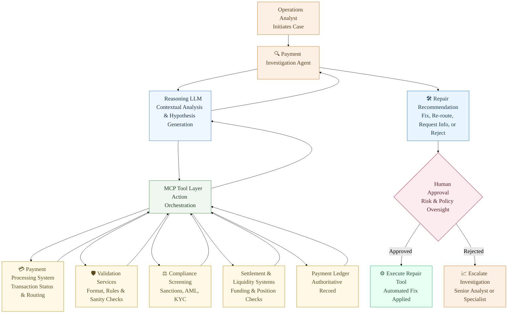
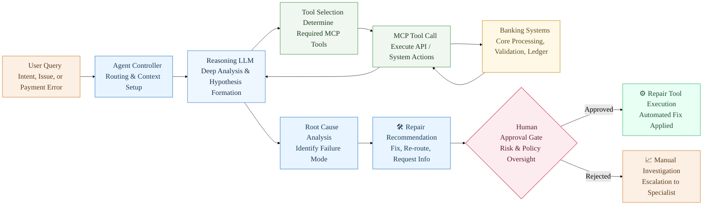
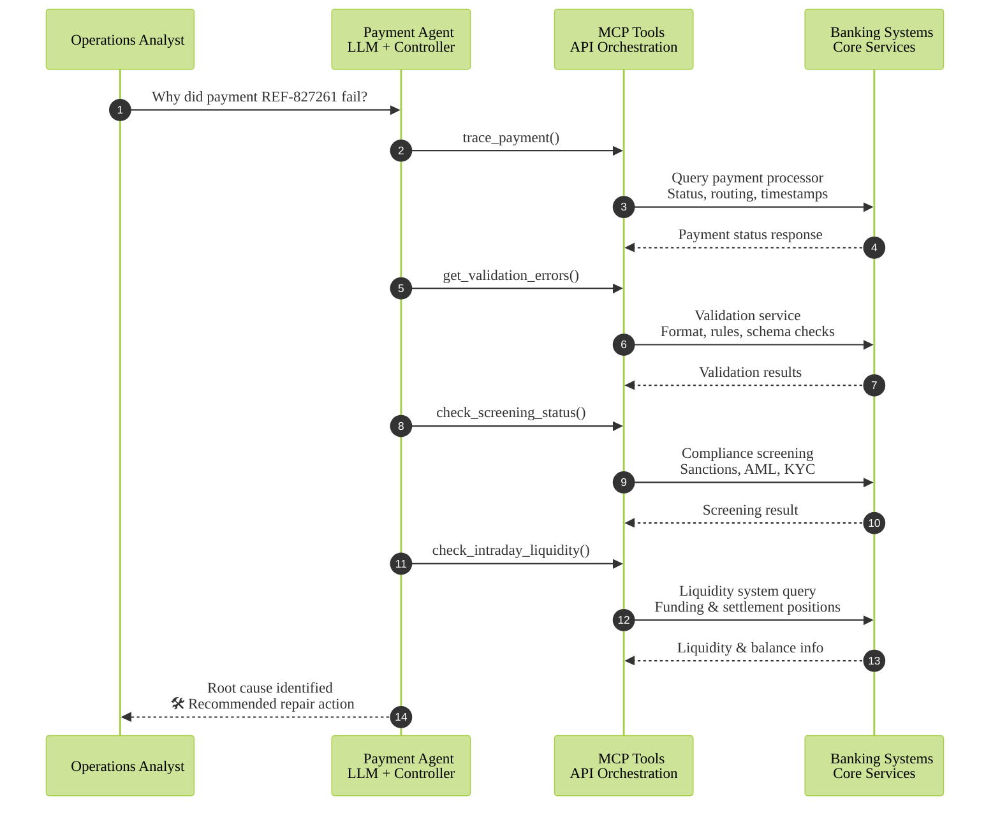

# Designing an Intelligent Payment Investigation & Repair Agent

Payment failures are one of the most operationally intensive workflows in banking systems.

Across payment types — real-time transfers, batch payments, internal transfers, or cross-border transactions — failures can occur due to:

* validation errors
* routing issues
* compliance flags
* liquidity constraints
* transient processing failures

When a payment fails, operations teams must investigate across several systems:

* payment processing engine
* validation and routing services
* compliance screening systems
* settlement or liquidity systems
* ledger records

Even a simple question like:

> Why did this payment fail?

often requires navigating **multiple dashboards and operational tools**.

This process is:

* manual
* dependent on expert knowledge
* repetitive
* difficult to scale

Most banks attempt to address this by building **more dashboards**.

But dashboards solve **visibility**, not **investigation**.

***

## Why AI Is Actually Useful Here

Many AI use cases in banking feel forced. Payment investigation is not one of them.

Investigating a failed payment is essentially a **structured reasoning workflow**:

1. Retrieve payment status
2. Check validation errors
3. Verify compliance screening
4. Confirm settlement liquidity
5. Identify the root cause
6. Determine whether the issue can be repaired

This is a **multi-step decision workflow across systems**.

AI agents are well suited for this because they can:

* orchestrate multiple system queries
* correlate signals across systems
* reason about failure causes
* summarize findings clearly

Instead of replacing systems, the AI agent acts as an **investigator that understands how those systems interact**.

***

## From Investigation to Repair

Once the root cause is identified, many payment issues can be repaired automatically.

Examples include:

* retrying transient processing failures
* correcting missing payment fields
* selecting alternative routing
* retrying after settlement funding

Instead of simply explaining the failure, the system can suggest a **repair action**.

```
AI investigates → AI suggests repair → Human approves → System executes
```

This introduces a **human-in-the-loop automation model** that balances speed with operational safety.

***

## Why Not Just Build Another Dashboard?

Dashboards assume operators already know:

* which system to check
* how to interpret errors
* how systems relate to each other

Modern banking platforms are **distributed architectures** with multiple services interacting.

Dashboards display **data fragments**.

AI agents instead:

* retrieve information dynamically
* correlate signals across systems
* explain the root cause

The difference is important.

Dashboard → **information display**

Agent → **problem investigation**

***

## Why MCP Instead of Direct API Access?

One might ask:

> Why not simply give the AI direct API access?

In regulated financial environments this introduces risks:

* uncontrolled system interactions
* inconsistent API usage
* limited governance
* lack of auditability

Model Context Protocol (MCP) introduces a **controlled capability layer** between AI agents and enterprise systems.

Instead of exposing raw APIs, MCP exposes **structured tools**.

Benefits include:

* permission-controlled capabilities
* schema validation
* auditable tool usage
* safer integration boundaries

MCP becomes the **interface layer between AI agents and banking systems**.

***

## Architecture Overview




This architecture introduces a **capability layer** that allows AI agents to safely interact with banking infrastructure.

***

## MCP Tools for the Payment Agent

Instead of calling APIs directly, the agent interacts with **domain-specific tools**.

#### Payment Trace MCP

```
trace_payment(payment_reference)
get_payment_status(payment_reference)
get_payment_route(payment_reference)
```

Connected systems:

* payment processing engine
* routing services
* payment ledger

***

#### Payment Validation MCP

```
get_validation_errors(payment_reference)
validate_payment_fields(payment_reference)
```

Connected systems:

* validation services
* payment gateway

***

#### Compliance MCP

```
check_screening_status(payment_reference)
get_compliance_flags(payment_reference)
```

Connected systems:

* AML monitoring
* compliance screening systems

***

#### Settlement & Liquidity MCP

```
get_settlement_balance(account_id)
check_intraday_liquidity(entity_id)
```

Connected systems:

* settlement accounts
* liquidity management systems

***

#### Repair Execution MCP

```
retry_payment(payment_reference)
repair_payment_fields(payment_reference)
route_payment_alternative(payment_reference)
```

Repair tools execute **only after human approval**.

***

## Agent Model Architecture

An effective payment investigation agent consists of three main components.

1. **Reasoning LLM**

The core model performs:

* investigation reasoning
* tool selection
* root-cause analysis

The model must support:

* multi-step reasoning
* function / tool calling
* structured outputs

***

2. **MCP Tool Layer**

MCP exposes safe operational capabilities.

The model decides **which tool to call**, and MCP executes the request.

***

3. **Human Control Layer**

All repair actions require **human approval**.

This ensures:

* operational oversight
* regulatory compliance
* auditability

***

## Agent Internal Architecture



This architecture separates **reasoning, tools, and control**.

***

## Agent Prompt Design

The intelligence of the system is not only in the model but also in the **operational prompt**.

Example system prompt:

```
You are a Payment Investigation and Repair Agent for banking operations.

Your goal is to determine the root cause of failed or delayed payments
and recommend the safest repair action.

Rules:
- Use MCP tools to gather evidence
- Do not guess system state
- Verify validation, compliance, and liquidity conditions
- Only recommend repair actions that are safe and reversible
- Always require human approval before execution

Investigation sequence:
1. Check payment status
2. Check validation errors
3. Check compliance screening
4. Check settlement liquidity
5. Determine root cause
6. Recommend repair if possible

Return:
- root cause
- supporting evidence
- confidence level
- recommended action
- human approval requirement
```

This prompt effectively encodes the **investigation playbook used by payment operations teams**.

***

## Investigation Workflow



***

## The Architectural Shift

Traditional operations workflow:

```
Human → Dashboards → Multiple Systems
```

Agent-driven workflow:

```
Human → AI Agent → MCP Tools → Banking Systems
```

The underlying banking systems remain the same.

Payment engines still process transactions.\
Compliance systems still screen payments.\
Liquidity platforms still manage settlement.

What changes is the **interface to those systems**.

Instead of operators manually navigating dashboards and correlating information across platforms, an intelligent agent performs the investigation — gathering evidence, explaining the root cause, and recommending the safest repair action.

In other words, the architecture does not replace banking systems.

It adds a **reasoning layer above them.**

And that reasoning layer may ultimately prove more valuable than simply adding another dashboard.
