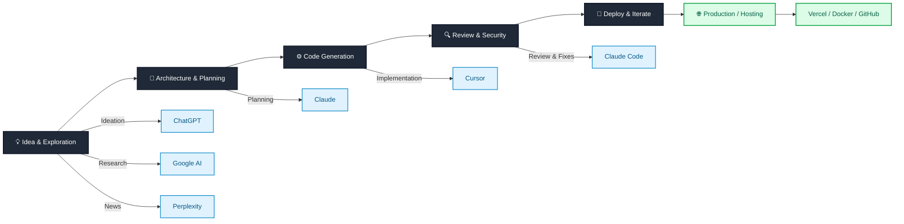

# My AI Stack (2026)

Over the last few months I started experimenting seriously with AI tools.

Not from a research perspective — but as a **practical way to learn faster, explore ideas, and build small solutions**.

I wouldn’t describe myself as an AI developer yet — more someone learning how to use these tools effectively.

This post explains the stack that currently supports that process.

***

## How I Use AI in Practice

Each tool in my setup plays a specific role.

Instead of relying on a single model, I use different tools depending on the stage of the idea.

The workflow usually looks like this:

**Idea → Architecture → Implementation → Review → Iterate**

***

## Visual Overview of My Stack

This setup lets me move quickly from an idea to something that actually runs.

***

## ChatGPT — Ideation & Thinking Partner

I primarily use ChatGPT for:

• Exploring ideas\
• Breaking down problems\
• Stress-testing concepts\
• Thinking through architecture options

It acts as a brainstorming partner when I’m refining an idea before building anything.

Many ideas never move beyond this phase — which is actually helpful because it saves time.

***

## Claude — Planning, Instructions, and Reviews

Claude plays a central role in my workflow after the initial idea phase.

I typically use it for:

• Generating build instructions\
• Designing the development plan\
• Refining the technical stack

For code-related work, I specifically use the **Claude Code desktop app** for:

• Code review\
• Identifying potential security concerns\
• Suggesting fixes and improvements\
• Debugging assistance

The larger context window makes it particularly useful when reviewing entire files or understanding how pieces of a project fit together.

***

## Cursor — Code Generation

For actual coding, I currently use Cursor.

It helps with:

• Generating code quickly\
• Iterating on features\
• Refactoring\
• Understanding unfamiliar patterns

Since I’m still early in Python and modern frontend tooling, this helps me move faster while learning.

***

## Google AI — Research & Search

I use Google’s AI features primarily for:

• Web search\
• Quick technical lookups\
• Cross-checking information

Since I already have the **Google One Premium 2TB family plan with AI**, it naturally became part of the workflow.

***

## Perplexity — News & Discovery

Perplexity is where I usually read:

• AI news\
• Tech updates\
• Industry developments

Interestingly, this came bundled free through my Bell subscription, so it became an easy addition.

***

## Developer Tooling Around the AI Stack

Outside the AI tools themselves, a few developer tools support my workflow.

My typical environment includes:

• VS Code\
• GitHub repositories\
• Docker for local experimentation\
• Vercel for simple deployments

On the development side I’m comfortable with:

• Node.js\
• Spring Boot\
• GitHub repository maintenance

Currently learning and experimenting with:

• Python\
• React / Vite\
• Tailwind

***

## Workstation Setup

My main machine at the moment is:

**MacBook Pro 2018 — 16GB Intel**

Surprisingly, it still holds up well for most of the experiments I run.

That said, an **M-series upgrade is definitely on the horizon**.

***

## Helpful Perks (University Benefits)

One unexpected bonus is access to several tools through my son’s university benefits at the University of Calgary.

That currently gives access to:

• Microsoft 365\
• IntelliJ Ultimate\
• PyCharm\
• GitHub Pro

These tools make experimentation easier without needing additional subscriptions.

***

## Work Environment

Through work I also have access to:

• GitHub Copilot\
• Microsoft 365 ecosystem

Copilot is particularly useful when working inside existing repositories.

***

## Why I Don’t Rely on Just One AI Tool

Different models are better at different stages of the process.

Instead of forcing one tool to do everything, I’ve found it more effective to combine them:

ChatGPT for ideation\
Claude for planning and review\
Cursor for implementation\
Google AI for research

This combination makes the workflow faster and often produces better results.

***

## My Current Perspective on AI

Right now I see myself less as an AI developer and more as someone **learning how to use AI effectively**.

Most of my experiments focus on:

• Building small tools\
• Solving personal problems\
• Learning modern stacks\
• Understanding how AI agents and integrations work

The goal is simple:

**Reduce the distance between an idea and something that actually works.**

***

## What Comes Next

Over time I’ll document the tools and experiments I’ve been building using this stack.

This includes:

• Small personal utilities\
• AI-assisted workflows\
• Agent experiments\
• Integrations with modern tooling

Some of these have already been shared individually, and I’ll consolidate them here as part of this documentation.
