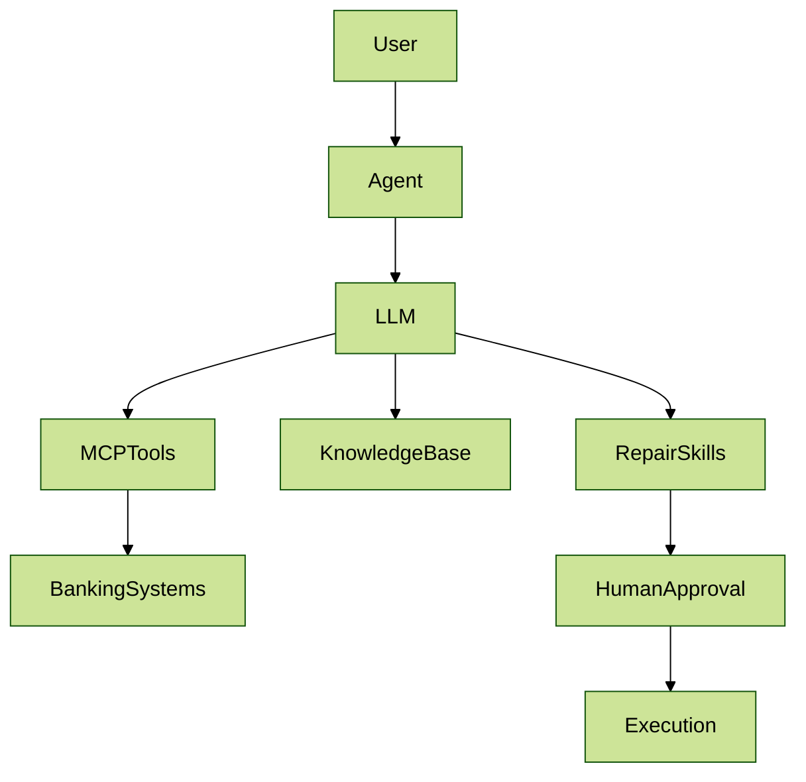

# Designing an Intelligent Payment Investigation & Repair Agent - Part 2

## 1. Recap of the Previous Architecture

In the previous article, we explored how an **AI Payment Investigation & Repair Agent** can orchestrate MCP tools to investigate payment failures across banking systems.

The architecture introduced:

* a reasoning LLM
* MCP tools exposing banking capabilities
* human-in-the-loop approval for repair actions

This approach transforms payment operations from **manual investigation** into **assisted decision workflows**.

But investigation alone is not enough.

To recommend reliable repair actions, the agent must also understand:

* payment rails
* message formats
* operational repair playbooks
* bank-specific policies

This is where **knowledge bases and skills** become important.

***

## 2. Why Investigation Alone Is Not Enough

An LLM may identify the **symptom** of a failure:

Example:

> Payment failed due to validation error.

But to propose the correct repair, the system must know:

* which fields are mandatory for the payment rail
* which errors are repairable
* which repairs are safe to automate
* which ones require escalation

Without domain knowledge, the model may generate **plausible but unsafe recommendations**.

Improving repair quality requires adding **structured operational knowledge**.

***

## 3. Adding a Payment Knowledge Base

A payment repair agent should have access to reference knowledge such as:

* payment rail rules
* ISO message definitions
* field validation rules
* error code catalogs
* repair eligibility guidelines

This knowledge should not be stored inside the LLM itself.

Instead, it should be exposed through **retrieval systems or MCP resources**.

Example knowledge sources:

* ISO 20022 message definitions
* internal payment schemas
* error code documentation
* routing rule tables

When the agent encounters an error, it can retrieve the relevant knowledge before proposing a repair.

Example flow:

```
Investigate failure
↓
Retrieve relevant rail rules
↓
Retrieve message validation rules
↓
Determine repair options
↓
Recommend safest repair
```

This keeps the LLM **grounded in authoritative knowledge**.

***

## 4. Introducing Repair Skills

Even with knowledge, repair decisions should not rely entirely on free-form reasoning.

Instead, repair logic can be encoded as **skills**.

A skill represents a reusable operational capability that the agent can invoke.

Skills capture the **playbooks used by payment operations teams**.

***

## 5. Example Payment Repair Skills

#### Validation Repair Skill

Triggered when required fields are missing.

Skill behavior:

* identify missing field
* retrieve field definition
* determine enrichment source

Example recommendation:

```
Root cause: Missing debtor address field

Suggested repair:
Populate debtor address from customer master record
and retry validation.
```

***

#### Liquidity Retry Skill

Triggered when settlement balance is insufficient.

Skill behavior:

* check funding events
* determine retry window

Example recommendation:

```
Root cause: Insufficient settlement balance

Suggested repair:
Retry payment after next settlement funding window.
```

***

#### Routing Recovery Skill

Triggered when routing or network path fails.

Skill behavior:

* identify alternate routing options
* validate rail compatibility

Example recommendation:

```
Root cause: Primary routing path unavailable

Suggested repair:
Route payment through alternate clearing channel.
```

***

#### Compliance Escalation Skill

Triggered when payment is flagged by screening.

Skill behavior:

* determine review requirements
* escalate to compliance operations

Example recommendation:

```
Root cause: Payment flagged during compliance screening

Recommended action:
Escalate to compliance team for manual review.
```

***

## 6. Updated Agent Architecture

With knowledge and skills added, the architecture evolves.



This architecture introduces two new capabilities:

* **knowledge retrieval**
* **repair skill execution**

***

## 7. Why Skills Improve Safety

Skills make the system more reliable because they:

* encode operational expertise
* reduce hallucination risk
* standardize repair recommendations
* improve auditability

The LLM focuses on **reasoning and orchestration**, while skills provide **deterministic operational logic**.

***

## 8. The Emerging Pattern

A mature banking agent stack will likely include:

* **LLM** → reasoning
* **MCP tools** → system access
* **knowledge bases** → domain context
* **skills** → operational playbooks
* **human approval** → governance

Together these components create **AI-assisted operations**, not uncontrolled automation.

***

## Closing Thought

The first generation of banking AI focused on **chatbots and summarization**.

The next generation will focus on **operational agents**.

Agents that can:

* investigate failures
* reason across systems
* apply repair playbooks
* assist operators in making safer decisions

The combination of **LLMs, MCP tools, knowledge bases, and skills** is what makes this possible.
