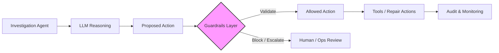

# Designing an Intelligent Payment Investigation & Repair Agent — Part 3

### 🔁 Quick Recap

In **Part 1**, we looked at how an agent can investigate payment issues.\
In **Part 2**, we added knowledge and repair skills.

So now the agent can:

* Understand the problem
* Suggest possible fixes

But a critical question remains:

> **Should the agent execute the action?**

***

### 🚨 The Real Problem: Control, Not Intelligence

LLMs are good at reasoning.\
Knowledge bases improve decision quality.

But in payment systems:

* Actions can be **irreversible**
* Errors can have **financial and regulatory impact**

👉 The challenge is not just _what the agent decides_\
👉 It’s **what the system allows it to do**

***

### 🧠 Guardrails as an Architecture Layer

Guardrails are not a feature.\
They are a **control layer** in your system.

A simple way to think about your agent architecture:

* Investigation (understand the issue)
* Knowledge (know what to do)
* Skills / Tools (execute actions)
* 👉 **Guardrails (control execution)**

***

### 🧭 Where Guardrails Fit

Guardrails should exist across the lifecycle — not just at one point.

#### 1. Before the Model

* Control inputs
* Filter sensitive or invalid data

***

#### 2. After the Model

* Validate what the model suggests
* Check for correctness or policy violations

***

#### 3. Before Tool Execution (Most Critical)

* Decide if an action is allowed
* Check rules, permissions, approvals

***

#### 4. After Tool Execution

* Validate outcomes
* Log actions for audit and traceability

🏗️ Reference Architecture

👉 Key idea:

> **LLM proposes → Guardrails validate → System executes**

***

### 💡 Why This Matters (Simple Example)

**Scenario:** Payment fails due to incorrect beneficiary details

Without guardrails:

* Agent suggests a fix
* System executes immediately

With guardrails:

* System checks:
  * Is modification allowed?
  * Is approval required?
  * Are rules satisfied?

👉 Outcome:

* Auto-repair **or**
* Escalation to operations

***

### 🔗 How Guardrails Are Implemented (Examples)

Guardrails are a pattern — different tools implement them in different ways.

***

#### 🧩 Policy-Driven Libraries (e.g., Edictum)

* Define rules / policies
* Validate actions before execution
* Control tool access

👉 Focus:\
**Decision validation at runtime**

***

#### 🏢 Platform-Based Guardrails (e.g., Infosys Topaz Fabric)

* Guardrails across lifecycle:
  * Before model
  * After model
  * Before tools
  * After tools
* Hooks for:
  * Input control
  * Output validation
  * Execution governance

👉 Focus:\
**End-to-end enterprise control**

***

### ⚖️ Key Takeaway

The future of AI systems is not just about smarter models.

It’s about:

> **LLM + Knowledge + Tools + Guardrails working together**

***

### 💬 Closing Thought

As AI agents become more capable, the real question is:

> _Not “Can the agent decide?”_
>
> but
>
> **“Should the agent execute?”**
