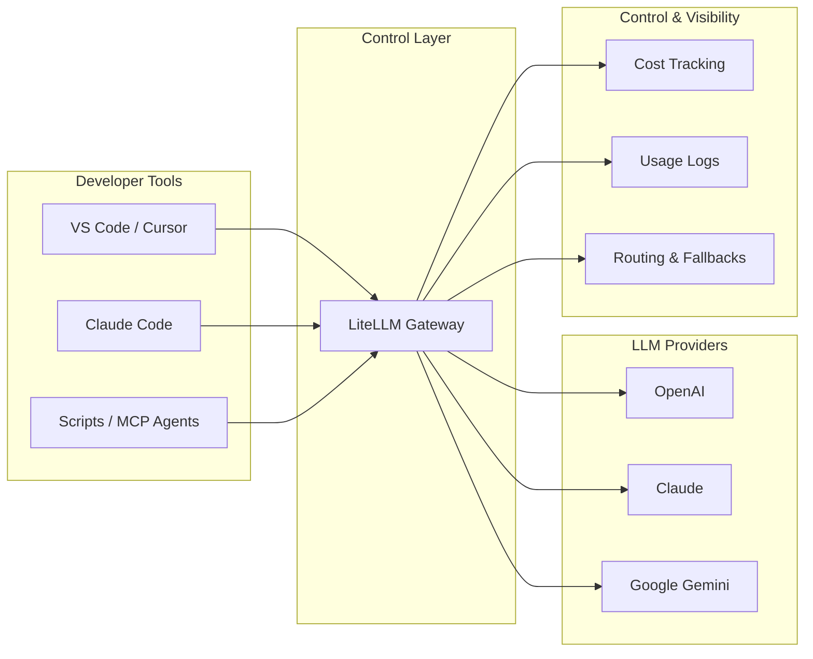

# LiteLLM — Adding a Control Layer to My AI Stack

As part of my evolving AI stack, I’ve been actively using multiple LLM providers based on the task:

* **Google AI (Gemini)** → quick lookups, fast responses
* **Claude** → structured reasoning, planning, reviews
* **OpenAI** → coding, integrations, tooling

This worked well initially.

But as usage increased, things started getting fragmented.

Different APIs.\
Different keys.\
Different SDKs.\
No clear visibility into cost or usage.

That’s when I introduced **LiteLLM** into my local workflow.

***

### The Problem I Was Facing

While working across:

* VS Code / Cursor
* Claude Code
* MCP-based agents
* small scripts (Node/Python)

I kept running into the same issues:

* Rewriting code for each provider
* No centralized usage or cost tracking
* Hard to compare outputs across models
* Scattered API key management

At small scale, this is manageable.

At multi-model scale, it becomes friction.

***

### What LiteLLM Changed

LiteLLM acts as a **local gateway (proxy)** between my tools and the models.

#### Before

```
App → OpenAI API  
App → Claude API  
App → Google AI API
```

#### After

```
App → LiteLLM → (OpenAI / Claude / Gemini)
```

This simple shift made a big difference.

***

### How I Use LiteLLM in Practice

#### 1. Unified Interface Across Models

I now interact with:

* OpenAI API
* Claude
* Google Gemini

using a consistent format.

No more provider-specific rewrites.

***

#### 2. Task-Based Model Routing

I don’t rely on a single model anymore.

Instead:

| Task                      | Model  |
| ------------------------- | ------ |
| Quick validation / search | Gemini |
| Structured reasoning      | Claude |
| Coding / integrations     | OpenAI |

With LiteLLM, switching models is configuration-driven — not code-driven.

***

#### 3. Cost & Usage Visibility

This was a major gap earlier.

Now I can:

* Track token usage
* Understand cost per model
* Evaluate cost vs output quality

This becomes critical when running:

* agents
* experiments
* multi-model workflows

***

#### 4. Centralized Key Management

Earlier:

* Keys were scattered across tools and scripts

Now:

* Managed in one place via LiteLLM

Benefits:

* cleaner setup
* easier rotation
* reduced leakage risk

***

#### 5. Faster Experimentation

This is where the real value shows.

I can:

* Run the same prompt across multiple models
* Compare outputs side-by-side
* Choose based on:
  * quality
  * latency
  * cost

This is extremely useful for:

* prompt tuning
* agent design
* architecture decisions

***

### Architecture — How My Setup Looks Now



***

### What I Realized

LiteLLM is not just a model switcher.

It acts as a:

> **lightweight control plane for LLM usage**

Especially when:

* working with multiple providers
* building agents or MCP tools
* optimizing cost vs performance

***

### When I Use LiteLLM vs Direct APIs

**Direct APIs**

* Single model testing
* quick experiments

**LiteLLM**

* multi-model workflows
* agents and automation
* cost tracking and comparison
* reusable tooling

***

### One Important Note

LiteLLM is evolving rapidly.

Before using in serious setups:

* pin versions
* verify updates
* avoid blindly pulling latest builds

***

### This Week’s Takeaway

Earlier my stack looked like:

> tools + models

Now it looks like:

> tools + models + **control layer**

LiteLLM is currently that control layer in my setup.
